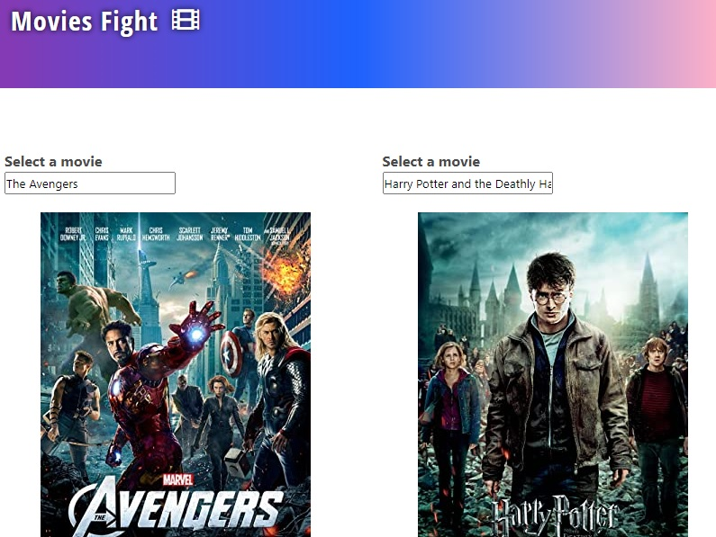

# MoviesBattleApp

## Demo

[**click live demo of the project**](https://dominiksiejka.github.io/MovieBattleApp)



## Table of Contents

- [About the Project](#description)
- [How to use](#how-to-use)
- [Technologies used](#built-with)
- [Setup steps](#setup)
- [Sources](#sources)
- [License](#license)

## Description

MoviesBattleApp it helps you to choose a better movie to watch. You search two different movies and then they are compared based on some statistics. The higher statistics are highlighted.

## How to use

There are two inputs. Two start to compare movies you need to fill the inputs with keywords about the movie or the title or some part of it. Then the list of movie will be fetched and then your choose the movie you are interested in. You do the same with the second input on the page. Then the results are compared and the higher statistics are highlighted so it may help you to choose the right movie to watch.

## Built with

- HTML5
- CSS
- Vanilla JavaScript
- Axios

## Setup

```
with BASH

# clone the remote repo to your local one
$ git clone https://github.com/dominiksiejka/MovieBattleApp.git

# open the index.html file or use your code editor to open it with live server

```

## Sources

- Icons from [Font Awesome ](https://fontawesome.com)
- Font from [Google Fonts ](https://fonts.google.com/)

## License

- MIT © [Dominik Siejka ](https://github.com/dominiksiejka/MovieBattleApp)
